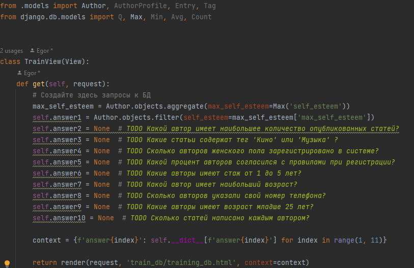
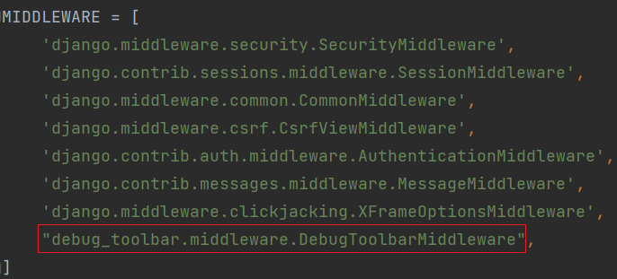
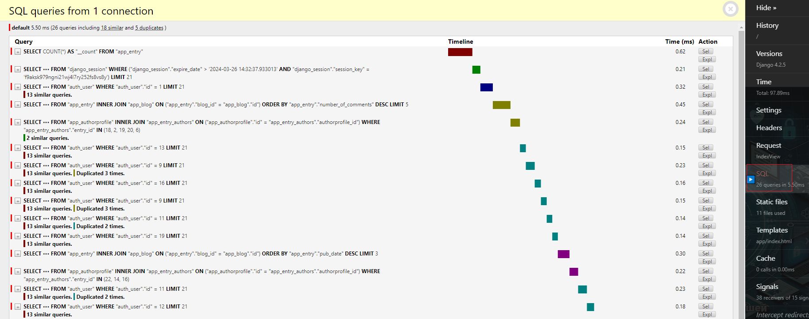
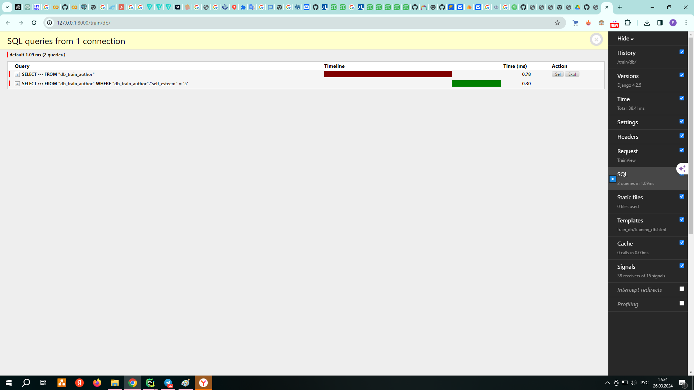
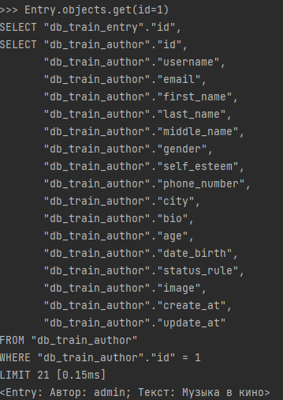

[TOC]

Вернем авторов на место (загрузим их из фикстуры), так как ранее частично удаляли их

```python
python manage.py loaddata files/lab1/data_author.json
```

# 1. Отношения таблиц

В Django, существует несколько типов отношений между таблицами, которые 
определяются с помощью ORM модели данных. Отношения могут быть:
* один-к-одному(One-to-One), 
* один-ко-многим(One-to-Many),
* многие-ко-многим(Many-to-Many). 
 
Давайте рассмотрим каждый тип:

## 1.1 Связь `Один-к-одному (One-to-One)`:

В отношении "один-к-одному" каждая запись одной таблицы связана с одной записью в другой таблице.
Часто такая таблица используется для расширения другой таблицы без изменения первоначальной. 
В Django это можно реализовать с помощью поля `OneToOneField`.

Вот пример, допустим мы захотели добавить данных в таблицу `Author`, но там и так уже очень много колонок. Можно создать отдельную
таблицу `AuthorProfile` и связать её с `Author` отношением один-к-одному. Таким образом ещё возможно разграничить доступ к таблицам, 
допустим к таблице `Author` есть доступ у всех, а к `AuthorProfile`, только у определенных пользователей.

В `models.py` приложения `apps/db_train` добавьте следующую таблицу.

```python
class AuthorProfile(models.Model):
    author = models.OneToOneField('Author')
    stage = models.IntegerField(default=0, 
                                blank=True,
                                verbose_name="Стаж",
                                help_text="Стаж в годах")
```

Через некоторое время выйдет предупреждение, что пропущен позиционный аргумент `'on_delete'`, Django хочет знать, что делать с данным связанным полем после удаления.


В контексте Django, параметр `on_delete` относится к внешнему ключу (foreign key), который определяет связь между двумя таблицами. 
Он указывает, что произойдет с записями в связанной таблице, если запись в родительской таблице будет удалена.

Т.е. в данном примере, необходимо указать, что делать со значением поля `author` в таблице `AuthorProfile` в случае удаления
связанной с ней строки таблицы `Author`

Параметр `on_delete` может принимать различные значения в зависимости от желаемого поведения при удалении связанной записи:

* `CASCADE`: Если запись в родительской таблице удаляется, все связанные записи в дочерней таблице также будут удалены.


* `PROTECT`: Запрещает удаление записи в родительской таблице, если на нее есть ссылки из дочерних таблиц. В этом случае будет вызвано исключение ProtectedError.


* `SET_NULL`: При удалении записи в родительской таблице, внешний ключ в дочерней таблице будет установлен в NULL. Это предполагает, что поле внешнего ключа разрешает значение NULL.


* `SET_DEFAULT`: При удалении записи в родительской таблице, внешний ключ в дочерней таблице будет установлен в значение по умолчанию.


* `SET`: При удалении записи в родительской таблице, внешний ключ в дочерней таблице будет установлен в указанное значение.


* `DO_NOTHING`: Ничего не делать. В этом случае будет оставлено на усмотрение базы данных обработка удаления записи в родительской таблице.


Воспользуемся чаще всего используемым параметром `models.CASCADE`, говорящей о том, что если автор будет удалён, то и его профиль тоже будет удалён.

```python
class AuthorProfile(models.Model):
    author = models.OneToOneField('Author', on_delete=models.CASCADE)
    stage = models.IntegerField(default=0, 
                                blank=True,
                                verbose_name="Стаж",
                                help_text="Стаж в годах")
```

Теперь две таблицы связаны отношением один к одному.

Создайте миграцию

```python
python manage.py makemigrations
```

И перенесите её в БД

```python
python manage.py migrate
```

## 1.2. Связь `Один-ко-многим (One-to-Many)`:

В отношении "один-ко-многим" каждая запись одной таблицы связана с несколькими записями в другой таблице. В Django это можно реализовать с помощью поля `ForeignKey`.

Пример: Создадим таблицу Entry(статья) которая будет связана с автором, но автор может создать несколько статей, и все они будут привязаны к автору, здесь
поможет отношение "один-ко-многим", где один автор может написать много статей.

В `models.py` приложения `apps/db_train` добавьте следующую таблицу.

```python
class Entry(models.Model):
    text = models.TextField(verbose_name="Текст статьи",
                            )
    author = models.ForeignKey("Author", on_delete=models.CASCADE, related_name='entries')
```

Здесь `related_name` используется для более удобному обращению к записям, через автора, т.е. в объекта автор появится мнимое поле, 
которого не существует в БД, но будет связь со всеми его статьями через поле `'entries'` эту связь также называют обратная связь.


Создайте миграцию

```python
python manage.py makemigrations
```

И перенесите её в БД

```python
python manage.py migrate
```

## 1.3. Связь `Многие-ко-многим (Many-to-Many)`:


В отношении "многие-ко-многим" несколько записей одной таблицы связаны с несколькими записями в другой таблице. В Django это реализуется с использованием поля `ManyToManyField`.

Пример: Создадим таблицу Tag(тэг) которая будет связана со статьей, но в одной статье может быть несколько тегов, а один тег использоваться в нескольких статьях, 
здесь поможет отношение "многие-ко-многим".

В `models.py` приложения `apps/db_train` добавьте следующую таблицу.

```python
class Tag(models.Model):
    name = models.CharField(max_length=50,
                            verbose_name="Название",
                            )
```

Теперь в `Entry` добавим поле `tags` чтобы хранить там ключи к тегам.

```python
class Entry(models.Model):
    # ...
    tags = models.ManyToManyField("Tag", related_name='entries')
```

Создайте миграцию

```python
python manage.py makemigrations
```

И перенесите её в БД

```python
python manage.py migrate
```

Далее покажем созданные таблицы в админ панели. (Вспомните на основе прошлой практики как регистрировать модели в `admin.py` для отображения в админ панели)

Теперь зайдём через админ панель и создадим пару строк в БД.

Начнем с тегов. Создадим 3 тега. "Кино", "Музыка", "Искусство"

Переопределите метод `__str__` в классах `AuthorProfile`, `Entry`, `Tag` по своему желанию, для более читаемого отображения строк в админ панели.

Если это необходимо, то к полям связанной модели можно обращаться через `.`, допустим так для `__str__` модели `AuthorProfile`

```python
class AuthorProfile(models.Model):
    # ...
    
    def __str__(self):
        return f"Автор: {self.author.username}; Стаж: {self.stage} лет"
```

Затем создайте пару записей в таблице `Entrys` в админ панели. Чтобы выбрать несколько тегов, зажмите `Ctrl`.

И создайте пару записей в `Authors profile`

Далее будем работать с запросами с БД, и нужны общие данные, чтобы проверить правильность выполнения запросов, поэтому чтобы не терять ваш
труд, то скопируем (`dumpdata`) данные из таблицы `db_train` в фикстуру, для этого выполним команду

```python
python -Xutf8 manage.py dumpdata --indent 4 db_train > my_db_train.json
```

Можете посмотреть созданный файл, что скопировалась только таблица `db_train` с вашими данными. Флаг `-Xutf8` используется
для переноса в кодировке utf-8, чтобы кириллица нормально отображалась.

Затем вставим данные в БД, чтобы заполнение было одинаковое.

```python
python manage.py loaddata files/lab2/db_train.json
```


# 2. Создание запросов

Чтобы полноценно ознакомиться с запросами и работой со связанными таблицами скопируем приложение `db_train_alternative` из
`files/lab2` в папку `apps`, затем добавим `'apps.db_train_alternative'` в `settings.py` в `INSTALLED_APPS`

Затем создадим миграции

```python
python manage.py makemigrations
```

Применим эти миграции

```python
python manage.py migrate
```

И начнем заполнять БД при помощи python скрипта. Для упрощения работы создадим json файл с данными для записи, а затем уже считаем этот файл 
и построчно запишем данные в БД.

Скопируйте файлы `convert_data_alter_to_json.py` и `fill_data_alter_in_db.py` из `files/lab2` в корень проекта.

Запустите `convert_data_alter_to_json.py` - он переведет списки словарей описанные в файле в json файлы.

Запустите `fill_data_alter_in_db.py` (особо не вчитываемся в код, только поверхностно, чтобы посмотреть, что через скрипт можно записывать, 
но иногда приходится применять сложные конструкции)- он прочитает json файлы, создаст из них списки словарей и запишет данные в БД.

Заметьте, что выполнение записи в `Author` намного быстрее, чем в другие из-за пакетной записи. Это потому, что запись всех значений происходит в одной транзакции.

Зачем было использовать промежуточный json? Просто, чтобы показать, откуда появились данные для записи

Бывает такое, что при записи могут произойти ошибки и заново проблематично запустить скрипт, так как некоторые поля содержат ограничения на уникальные значения, и
записать заново не выйдет. В таком случае применим механизм отката миграций, так как он позволяет откатить и данные записанные после миграции.

Проверим, что заново запустить скрипт не выйдет. 

Запустите `fill_data_alter_in_db.py` и получите ошибку, что значения не соответствуют требованиям уникальности.

Затем откатим миграцию. Так как в приложение `db_train_alternative` была всего одна миграция, то откатим первую, т.е. вернем к состоянию до добавления миграции. Соответственно 
все данные связанные с данным приложением добавленные после миграции тоже исчезнут.

```python
python manage.py migrate db_train_alternative zero 
```

В данном случае `zero` означает полный откат всех миграций что были в приложении `db_train_alternative`, если нужно было бы откатить к какой-то конкретной, то
в таком случае написали бы номер миграции, допустим 0001.


Теперь просто заново применим миграцию

```python
python manage.py migrate
```


И заново запустим скрипт записи данных в БД `fill_data_alter_in_db.py`

Альтернативная БД заполнена, теперь настало время делать запросы.

В прошлый раз, мы работали через консоль (`python manage.py shell`). Теперь поработаем через скрипт python

Скопируйте файл `queryes.py` из `files/lab2` в корень проекта. Запросы будете производить в нём.

Почитайте и выполните запросы из файла `queryes.md` из `tasks/lab2`. Запросы выполняйте в файле `queryes.py`, который скопировали
в корень проекта ранее.

# 3. Отображение запросов на HTML странице

После того как появилась ясность с созданием запросов, то осталось отобразить этот результат не в консоли, а на странице,
чтобы было удобнее и нагляднее. После того как получили ответ из базы данных, то передача в шаблон делается просто, ровно так же
как и при передаче обычных значений в шаблон, через `context`.

Замените файл `training_db.html` в папке `apps/db_train/templates/train_db`, на аналогичный файл `training_db.html` 
из папки `files/lab2`

Для начала необходимо подгрузить модели

Во `views.py` приложения `db_train` пропишем:

```python
from .models import Author, AuthorProfile, Entry, Tag
```

Затем в класс `TrainView` внесите следующие изменения:

```python
from django.db.models import Q, Max, Min, Avg, Count

class TrainView(View):
    def get(self, request):
        # Создайте здесь запросы к БД
        self.answer1 = None  # TODO Какие авторы имеют самую высокую уровень самооценки(self_esteem)?
        self.answer2 = None  # TODO Какой автор имеет наибольшее количество опубликованных статей?
        self.answer3 = None  # TODO Какие статьи содержат тег 'Кино' или 'Музыка' ?
        self.answer4 = None  # TODO Сколько авторов женского пола зарегистрировано в системе?
        self.answer5 = None  # TODO Какой процент авторов согласился с правилами при регистрации?
        self.answer6 = None  # TODO Какие авторы имеют стаж от 1 до 5 лет?
        self.answer7 = None  # TODO Какой автор имеет наибольший возраст?
        self.answer8 = None  # TODO Сколько авторов указали свой номер телефона?
        self.answer9 = None  # TODO Какие авторы имеют возраст младше 25 лет?
        self.answer10 = None  # TODO Сколько статей написано каждым автором?

        context = {f'answer{index}': self.__dict__[f'answer{index}'] for index in range(1, 11)}

        return render(request, 'train_db/training_db.html', context=context)
```

Данная конструкция 

```python
context = {f'answer{index}': self.__dict__[f'answer{index}'] for index in range(1, 11)}
```

была написана из-за лени, чтобы не создавать словарь большого размера вручную.

Для тренировки напишите запросы и ответьте на следующие вопросы (Ответ на первый вопрос будет ниже, над остальными думаем самостоятельно.
`Не нужно стараться сделать запрос в одну строку. Вполне допустимо использование промежуточных переменных, если это необходимо`):
1. Какие авторы имеют самую высокую уровень самооценки(self_esteem)?
2. Какой автор имеет наибольшее количество опубликованных статей?
3. Какие статьи содержат тег 'Кино' или 'Музыка'?
4. Сколько авторов женского пола зарегистрировано в системе?
5. Какой процент авторов согласился с правилами при регистрации?
6. Какие авторы имеют стаж от 1 до 5 лет?
7. Какой автор имеет наибольший возраст?
8. Сколько авторов указали свой номер телефона?
9. Какие авторы имеют возраст младше 25 лет?
10. Сколько статей написано каждым автором?

Ответом на первый вопрос будет

```python
max_self_esteem = Author.objects.aggregate(max_self_esteem=Max('self_esteem'))
self.answer1 = Author.objects.filter(self_esteem=max_self_esteem['max_self_esteem'])
```




При переходе на главную страницу на вкладку `Запросы` или по адресу http://127.0.0.1:8000/train/db/
появятся ваши отображения результатов запросов.


Остальные ответы заполните самостоятельно. Можете менять шаблон `training_db.html` под ваши нужны и запросы.

# 4. Работа с Django debug tool bar

Последнее, что осталось, это как-то мониторить то, что делаете в БД, для этого 
воспользуемся библиотекой `django debug toolbar` 

https://django-debug-toolbar.readthedocs.io/en/latest/installation.html

```
pip install django-debug-toolbar
```

Затем в settings.py необходимо прописать

в INSTALLED_APPS

```python
INSTALLED_APPS = [
    # ...
    "debug_toolbar",
    # ...
]
```

в MIDDLEWARE в конец списка добавьте

```python
MIDDLEWARE = [
    # ...
    "debug_toolbar.middleware.DebugToolbarMiddleware",
]
```


В конце `settings.py` добавьте

```python
INTERNAL_IPS = [
    "127.0.0.1",
]
```

В корневой `urls.py` в `if settings.DEBUG:` необходимо добавить

```python
# После urlpatterns += static(settings.MEDIA_URL, document_root=settings.MEDIA_ROOT)
urlpatterns += [
    path("__debug__/", include("debug_toolbar.urls")),
]
```


Теперь если зайти на любую страницу, то появится дополнительное окно, где можно 
получить дополнительную информацию, допустим такую как время выполнения SQL запроса 
и что конкретно выполнялось

---

Если панель не появилась, а в консоле вылезло следующее пердупреждение


То решение этой задачи следующее:

Зайдите в `settings.py` папки `project` и в конце файла пропишите


```python
import mimetypes

mimetypes.add_type("application/javascript", ".js", True)

DEBUG_TOOLBAR_CONFIG = {
    "INTERCEPT_REDIRECTS": False,
}
```

Теперь панель должна отображаться в браузере при переходе на сайт (Если не отображается, то попробуйте перезагрузить страницу с перезагрузкой статических файлов.
В большинстве браузеров это сочетание `Ctrl+Shift+R`)

---
Пример для главной страницы



Для страницы http://127.0.0.1:8000/train/db/ при одном ответе будет такой результат




Посмотрите как в зависимости от сложности запросов будет отличаться время и число запросов в БД.


## 4.1 Отображение запросов в консоли

Также есть возможность отображения дополнительный информации в консоли при работе с ORM

Для этого вызовите 

```python
python manage.py debugsqlshell
```

Появится интерактивная консоль с возможность создания запросов и отображения их через ORM

Выполните следующий запрос в этой консоле
```python
from apps.db_train.models import Entry
Entry.objects.get(id=1)
```



Посмотрите как ORM трансформирует запрос в SQL запрос для других запросов, допустим тех, что вы писали при ответе на вопросы. 

```python
Entry.objects.values('author__username', 'text').get(id=1)
```


# Практика окончена

---

# 5. <u>Необязательный блок</u> (выполнение по желанию, на результат следующих практик влиять не будет)

## 5.1 Подключение к PostgreSQL

Прочитайте данный материал в файле `db_postgre.md` в папке `tasks/lab2`

## 5.2 Подключение к БД через модули python

Прочитайте данный материал в файле `db_other.md` в папке `tasks/lab2`